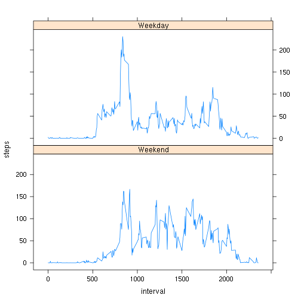

# Reproducible Research: Peer Assessment 1

## Loading and preprocessing the data
I've opted to use fread from the library data.table to load the data. We get useful information directly from here so there's no need for further processing at this point.


```r
library("data.table")
data <- fread("activity.csv", sep=",", na.strings="NA")
```

## What is mean total number of steps taken per day?

For this assignment we ignore the missing values in the dataset.

### Total number of steps taken (histogram)
Load the data into total_steps, we split by date and use the sum function to get the total per day, then use hist to get a histogram.

```r
total_steps <- sapply(split(data$steps, data$date), sum, na.rm = TRUE)
hist(total_steps)
```

 

### What is the mean and median of the total number of steps taken per day?

```r
mean(total_steps)
```

```
## [1] 9354
```

```r
median(total_steps)
```

```
## [1] 10395
```

This gives us a mean of 9354 and a median of 10395.

## What is the average daily activity pattern?
I split by interval and apply the mean function to get the mean of the steps taken on an interval basis over all days and store this in activity_pattern.


```r
activity_pattern <- sapply(split(data$steps, data$interval), mean, na.rm = TRUE)
```

### Average daily activity pattern time series plot
I've opted to use the base plot function to plot the number of steps taken.


```r
plot(labels(activity_pattern), activity_pattern,
	main='Average number of steps taken, averaged across all days',
	type='l',
	ylab='Number of Steps',
	xlab='interval',
)
```

 

### 5-minute intervals with most steps on average
We can just sort the activity_pattern and use the label for it to get the 5-minute interval with most steps.

```r
last(labels(sort(activity_pattern)))
```

```
## [1] "835"
```
The 5-minute interval with most steps taken is "835".


## Imputing missing values


### Calculate the total number of missing values

```r
sum(is.na(data$steps))
```

```
## [1] 2304
```

There are 2304 missing values.

### Devise a strategy for filling in all missing values in the dataset

I have chosen to use the average number of steps taken in the 5-minute interval to fill in missinga values. We can use the previous activity_pattern object to access these.

I'm using a simple transform to create a new dataset with the average put in place of NA.


```r
new_dataset <- transform(data, steps = ifelse( is.na(steps), activity_pattern, steps) )
```

### Mean and Median

```r
mean(total_steps_newdata)
```

```
## [1] 10766
```

```r
median(total_steps_newdata)
```

```
## [1] 10766
```

Now this is interesting, the mean and median now turn out to be the same. How can this be? The fact that they differ isn't particularly conscerning, as we've added more data points and used the mean on the other points.

### Histogram of the total number of steps taken

```r
total_steps_newdata <- sapply(split(new_dataset$steps, new_dataset$date), sum, na.rm = TRUE)
hist(total_steps_newdata)
```

 

Compared with the previous histogram this imputation does appear to possibly skew the data. The middle of the road frequency is a lot more defined compared with the frequency of days with less steps, which now appear less frequent.

## Are there differences in activity patterns between weekdays and weekends?

We're going to first alter the dataset we've just recently created, new_dataset, and indicate if a certain measurement is taken on a weekend or a weekday, using the factor labels "Weekend" and "Weekday".


```r
new_dataset$day <- factor(ifelse(weekdays(as.POSIXct(new_dataset$date)) %in% c("Saturday","Sunday"), 1, 2), labels=c("Weekend","Weekday"))
```

We're going to produce a panel plot showing the average number of steps taken in a 5-minute interval averaged across all weekday days or weekend days.


```r
library("lattice")
avg_dataset <- aggregate( steps ~ interval + day, data=new_dataset, FUN=mean)
attach(avg_dataset)
xyplot(steps~interval|day, layout=c(1,2), type='l')
```

 

